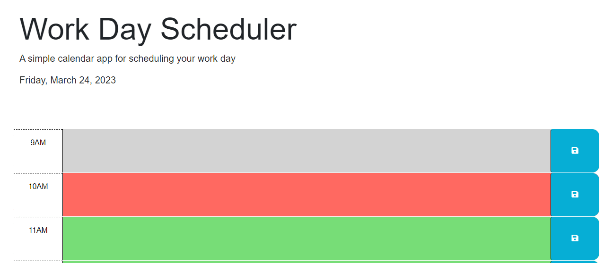

# Daily Planner

## Description

Setup a daily planner for the work day. Planner shows the current date, and when opened has color blocks denotating past, present, and future time from the current time. User can save their event in localStorage. Events are saved on a refresh so that user can see what they had previously entered.

## Usage

Screenshot

## Deployment

https://jenwariner19.github.io/daily-planner/

## Languages

HTML, CSS, JavaScript

## Credits

Worked with BCS Learning Assistant, tutor Chris Baird, and classmate, Shannon Price
